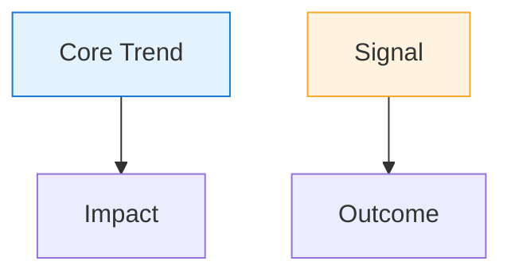

# Multi-Method Market Analysis

A skill for producing rigorous, structured market analysis using multiple complementary methodologies. Two prompt variants are available depending on the user's goal.

---

## Interaction Tool Guidelines

**IMPORTANT**: When the user needs to choose between predefined options, ALWAYS use the `question` tool (if available) with enumerated format:
- Options with short `label` and `description`
- Examples: variant selection (General Deep/Weekly Intelligence), topic confirmation, geographic focus, etc.

When `question` tool is not available, use enumerated text in chat (A/B/C/D or 1/2/3).

---

## When to Use Each Variant

- **General Deep Analysis**: For broad, timeless strategic studies of a topic, market, or industry over time horizons (past → present → future 5 years).
- **Weekly Intelligence Canvas**: For fast-moving, 7-day competitive intelligence reports. Works best with real-time search tools (e.g., Grok, Perplexity, or Claude with web search).

---

## Variant 1: General Deep Market Analysis

Use this when the user wants a comprehensive, methodologically rigorous study of a topic across time.

### Prompt Template

```
Study Topic: [FILL IN]
Focus on: [Enter 'Global' or the specific country/region name here]

Goal: Conduct a DEEP market analysis of the study topic.
Cover [Focus on] insights in English.

Methodologies: Use the following methodologies with in-depth details:
- PESTLE
- Foresight (Weak and Strong Signals)
- Delphi
- Wardley Maps

Organize the analysis into:
- Recent Past (1 year ago)
- Current Trends (Today to 1 year)
- Future Predictions (Next 5 years)
```

### How to Apply

1. **Ask the user for their inputs** (if not already provided):
   - Use `question` tool to confirm:
     - **Variant**: "General Deep Analysis" (broad strategic study) or "Weekly Intelligence Canvas" (7-day competitive intelligence)
     - **Study Topic**: The market, industry, or topic to analyze
     - **Geographic Focus**: "Global" or specific country/region
   - Always include option: "I want you to recommend based on context"
   - Fallback (no question tool): "What would you like to analyze? (variant: General Deep or Weekly Intelligence, topic: [your topic], focus: Global or [region])"

2. Apply all four methodologies to each time horizon.
3. Synthesize findings into a coherent narrative, not just isolated frameworks.

---

## Variant 2: Weekly Intelligence Canvas

Use this for a structured 7-day competitive intelligence report. Best suited for users who want to track a specific niche or business context on a recurring basis.

### Required Inputs (ask the user if not provided)

- Use `question` tool to gather:
  - `{my business}`: The user's company or product
  - `{my job to be done or niche}`: The market/niche to analyze
- Always include option: "I want you to recommend based on context"
- Fallback (no question tool): Ask directly for business and niche/topic

### Prompt Template

```
**Context:**
{my business}: [fill it here]
{my job to be done or niche}: [fill it here]

You are an industry analyst specializing in {my job to be done or niche}.

### 🎯 Task
For the past 7 days, collect and analyze all relevant:
- 📰 Announcements, product releases, and feature updates
- 🤝 Partnerships, M&A, funding rounds
- ⚖️ Regulatory or policy changes
- 🔍 Strategic signals and foresight indicators

### 🌐 Data Sources
Search across:
- Company blogs, press releases, GitHub changelogs
- News sites relevant to the niche
- LinkedIn, X (Twitter), Reddit (practitioner communities)
- Traditional forums where relevant

### 🧮 Analytical Lenses
Apply multi-method market analysis:
- 🎯 Identify indirect and hidden competitors (tools, services, AI agents, startups addressing similar jobs)
- 🏛 PESTLE: Political, Economic, Social, Technological, Legal, Environmental
- 🔮 Foresight: Weak & strong signals + strategic implications
- 🗣 Delphi Method: Expert consensus from practitioner sentiment
- 🗺 Wardley Mapping (ASCII): Visualize capability evolution

### 🧾 OUTPUT FORMAT: EXECUTIVE CANVAS (Markdown)

#### 📊 Weekly Intelligence Canvas
**Period:** Last 7 Days
**Focus:** {my job to be done or niche}

---

#### 🎯 1. Executive Summary (3 bullets max)
> • One-sentence market shift
> • Top 2 leaders and their moves
> • Emerging threat or disruption

---

#### 🚀 2. Top Announcements (Grid)
| 🏢 Company | 🧩 Type | 📰 Summary | 🔗 Link |
|------------|---------|------------|---------|

---

#### 💡 3. Key Insights (Mermaid Flow + Bullets)



- Short insight 1
- Short insight 2
- PESTLE highlight (1 line)

---

#### 🧭 4. Competitive Snapshot

##### 4.1 This Week's Movers
| Platform | Move | Impact | Position |
|----------|------|--------|----------|

##### 4.2 Hidden Threats (JTBD)
| 🕵️ Entity | Category | Job Solved | Displacement Risk | 🔗 Main Link | 📚 Sources |
|-----------|----------|-----------|-------------------|--------------|------------|

> 1 concise paragraph on how these shift buyer perception, pricing, or adoption.

---

#### 🔮 5. Foresight Signals
| 🔎 Signal | Strength | Implication |
|-----------|----------|-------------|

---

#### 🗺 6. Wardley Evolution (ASCII)

```
Users
  ↓
[Custom]
  ↓
[Product]
  ↓
[Commodity]
  ↓
[Genesis]
```

**Brief Explanation (2 bullets max):**
- **↑ This Week**: [What moved up] → becoming more mature/standardized.
- **Implication**: [1-sentence strategic meaning]

---

#### ✅ 7. Recommended Actions
1. Tactical response to top competitor
2. Counter to hidden threat
3. Strategic product/marketing play
4. Community or partnership idea

---

#### 📎 Sources & Links
- [Source 1 Title](URL)
- [Source 2 Title](URL)
```

### Style Rules for the Canvas
- Use emojis consistently (🏢 🚀 💡 🧭 🔮 🗺 ✅ 📎)
- Keep all text scannable (< 2 pages)
- Use **bold** for emphasis, not italics
- Include a Mermaid flow in section 3 and an ASCII Wardley Map in section 6
- Cite sources with real clickable links — no inline citations

---

## Methodology Reference

| Methodology | Purpose |
|-------------|---------|
| **PESTLE** | Macro-environment scan across 6 dimensions |
| **Foresight** | Identify weak and strong signals for future shifts |
| **Delphi** | Synthesize expert/practitioner consensus |
| **Wardley Maps** | Visualize the evolution of capabilities in a value chain |

---

## Output Format

- Variant 1: Structured markdown report organized by time horizon and methodology
- Variant 2: Executive Canvas in markdown, ready for Notion, Miro, or Canva
