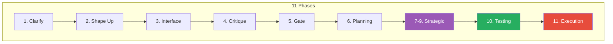

# @renatocaliari/pi-product-workflow

**Product workflow package for pi.dev coding agent.** Orchestrates Shape Up Planning → Interface Brainstorming → Plan Critique → Tech Planning → Execution. Includes 16 specialized skills, TUI tracking, and AI-aware testing strategy.

---

## 🚀 Quick Start

```bash
# Start a new workflow (with file references and draft text)
/product-workflow-start @brief.md "additional context"

/product-workflow-start @spec.md @requirements.md "OAuth login flow"

# Or run the skill directly
/skill:cali-product-workflow
```

---

## 🔄 Workflow Flow



> **Note:** Phases 7-9 run strategic analysis (JTBD, Opportunity, Market) in parallel if selected.

### Phase Descriptions

| Phase | Name | Purpose | Output |
|-------|------|---------|--------|
| 1 | Clarify | Capture context, establish boundaries | Draft text, references |
| 2 | Shape Up | Shape the proposal with problem/solution/scope | `spec-product.md` |
| 3 | Interface | Generate interface proposals (5 archetypes) | `interfaces.md` |
| 4 | Critique | Review plan with audit checklists | `critique-report.md` |
| 5 | Gate | Plannotator review, approve/reject | `*.receipt.md` |
| 6 | Tech Planning | Sequence scopes, add test strategy | `spec-tech.md`, `testing-strategy.md` |
| 7-9 | Strategic Analysis | JTBD, Evolutionary, Opportunity, Market | Strategic artifacts |
| 10 | Testing Strategy | AI-aware testing for software products | `testing-strategy.md` |
| 11 | Execution | Execute approved scopes via `/goal` | Delivered features |

---

## 🎮 Commands

All commands use the `/product-workflow-` prefix. Short `/pw:` aliases work too.

### Navigation

| Command | Alias | Description |
|---------|-------|-------------|
| `/product-workflow-start` | `/pw:start` | Start workflow with optional `@files` and text |
| `/product-workflow-stop` | `/pw:stop` | Stop workflow, clear UI immediately |
| `/product-workflow-pause` | `/pw:pause` | Pause workflow, keeps state |
| `/product-workflow-resume` | `/pw:resume` | Resume paused workflow |
| `/product-workflow-complete` | `/pw:complete` | Mark workflow complete, clear UI |
| `/product-workflow-menu` | `/pw:menu` | Open interactive overlay with phase list |

### Visual Feedback

| Action | Result |
|--------|--------|
| Start | Footer shows `│ {name} │ ◆ {phase} {n}/7 │` |
| Pause | Footer shows `│ ⏸ {name} │` (warning color) |
| Resume | Footer returns to normal |
| Stop/Complete | Footer cleared |
| Phase advance | Toast: `◆ {name} — entered {phase} ({n}/7)` |

---

## 🧪 Testing Strategy (Software Products Only)

When `product_type: software` or `product_type: hybrid`, the workflow auto-activates `cali-testing-ai-code` skill.

### Greenfield (New Code)

| Test Type | Use Case | TDD? |
|-----------|----------|------|
| `test-unit` | Business logic, critical paths | ✅ Yes |
| `test-integration` | DB, APIs, queues | No |
| `test-security` | Auth, payment, data | No |
| `test-behavior` | AI agents, multi-step flows | No |

### Brownfield (Existing Code)

| Test Type | Use Case |
|-----------|----------|
| `test-regression` | Protect existing functionality |
| `test-characterization` | Document current behavior (golden tests) |
| `test-simulation` | Replay past successful tasks |
| `test-impact` | TDAD-style dependency analysis |

### Mutation Targets

| Path Type | Target | Minimum |
|-----------|--------|---------|
| Critical | 70% | 60% |
| Standard | 50% | 40% |
| Experimental | 30% | 20% |

### CI/CD Gates

```yaml
mutation_score: < target → BLOCK
security_findings: > 0 on critical → BLOCK
flaky_rate: > 5% → WARN
```

---

## 📋 Skills (16)

### Orchestrator
| Skill | Command | Description |
|-------|---------|-------------|
| **Product Workflow** | `/skill:cali-product-workflow` | Main orchestrator (11 phases) |

### Planning
| Skill | Command | Description |
|-------|---------|-------------|
| **Shape Up** | `/skill:cali-shape-up` | Shape proposals (problem/solution/scope) |
| **Interface Brainstorm** | `/skill:cali-interface-brainstorm` | 5 interface archetypes |
| **Plan Critique** | `/skill:cali-plan-critique` | Audit checklists |
| **Tech Planning** | `/skill:cali-tech-planning` | Scope sequencing |

### Strategic Analysis
| Skill | Command | Description |
|-------|---------|-------------|
| **Short Cycle** | `/skill:cali-product-short-cycle` | Rapid validation method |
| **Opportunity Mapping** | `/skill:cali-product-opportunity-mapping` | Strategic opportunities |
| **Job-to-Be-Done** | `/skill:cali-product-job-to-be-done` | JTBD framework |
| **Evolutionary Principles** | `/skill:cali-evolutionary-principles` | Product evolution |
| **Multi-Method Market** | `/skill:cali-product-multi-method-market-analysis` | PESTLE, Wardley, Foresight |

### Domain Libraries
| Skill | Command | Description |
|-------|---------|-------------|
| **Ads** | `/skill:cali-product-ads` | Transtheoretical advertising |
| **Business Models** | `/skill:cali-product-business-models` | Business model creativity |
| **Health** | `/skill:cali-product-health` | Product health monitoring |
| **Marketplace** | `/skill:cali-product-marketplace-playbook` | Supply/demand balance |
| **Open Source** | `/skill:cali-product-open-source` | Open source strategy |
| **Pricing** | `/skill:cali-product-pricing` | Pricing strategies |
| **Promotions** | `/skill:cali-product-promotions` | MAGIC launch framework |
| **Trust Building** | `/skill:cali-product-trust-building` | Trust mechanisms |

### Execution
| Skill | Command | Description |
|-------|---------|-------------|
| **Scope Executor** | `/skill:cali-product-scope-executor` | Autonomous scope execution |
| **Testing AI Code** | `/skill:cali-testing-ai-code` | AI-aware testing strategy |

---

## 🖥️ TUI Visual

**Active Workflow:**
```
│ auth-system  │  ◆ Shape 3/7  │  2 assumptions  │  /pw:menu for details
└─────────────────────────────────────────────────────────────────────
```

**Active with Artifacts:**
```
│ auth-system  │  ◆ Interface 3/7  │  5 proposals · hybrid:C  │  /pw:menu
└─────────────────────────────────────────────────────────────────────────
```

**Paused:**
```
│ ⏸ auth-system                                       │  ← Warning color
└─────────────────────────────────────────────────────────────────────
```

### Interactive Overlay (`/pw:menu`)

```
╔═══════════════════════════════════╗
║  ◆ auth-system                    ║
║                                   ║
║  ✓ Clarify                       ║
║  ◆ Shape   ← current             ║
║  ○ Interface                     ║
║  ○ Critique                      ║
║  ○ Gate                          ║
║  ○ Planning                      ║
║  ○ Execution                     ║
║                                   ║
║  ↑↓ navigate  n:next  s:stop     ║
╚═══════════════════════════════════╝
```

---

## 📁 Artifact Directory

```
.cali-product-workflow/
└── {YYYY-MM-DD}/
    └── {_dir}/          # Hash-based, stable on rename
        ├── index.json
        ├── specs/               # spec-product.md
        ├── interfaces/          # interfaces.md
        ├── plans/               # spec-tech.md, testing-strategy.md
        ├── critiques/          # critique-report.md
        ├── strategic/           # JTBD, opportunity, market analysis
        ├── approvals/           # *.receipt.md
        └── sessions/            # checkpoint.json
```

---

## 🔧 Dependencies

| Extension | Package | Purpose |
|-----------|---------|---------|
| **pi-subagents** | `pi-subagents` | Parallel execution |
| **pi-goal** | `@capyup/pi-goal` | `/goal`, `/sisyphus` modes |
| **plannotator** | `@plannotator/pi-extension` | Plan review with `--gate` |
| **autoresearch** | `pi-autoresearch` | Optimization experiments |
| **ask-user-question** | `@juicesharp/rpiv-ask-user-question` | Structured questions |
| **intercom** | `pi-intercom` | Session messaging |
| **supervisor** | `pi-supervisor` | Outcome steering |

---

## 📦 Installation

```bash
# From local path
pi install ~/Development/pi-product-workflow

# From npm (after publishing)
pi install npm:@renatocaliari/pi-product-workflow

# Copy AGENTS.md for automatic triggering
cp ~/Development/pi-product-workflow/AGENTS.md ~/.pi/agent/AGENTS.md
```

---

## 📊 Version

**Current**: 0.2.2-alpha

**Latest Release:** [v0.2.2-alpha](https://github.com/renatocaliari/pi-product-workflow/releases/latest)

---

## License

MIT - Cali 2024